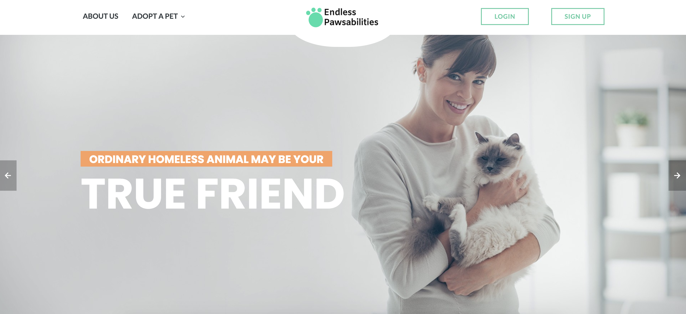

# Endless Pawsabilities

## Goal:

A full-stack app that has the basics of a pet adoption site that also allows the admin to review submitted pet adoption applications. When an application has been approved, an email will be sent to the user.

View project in browser: https://endless-pawsabilities.herokuapp.com/

## How It's Made:

**Tech Used**: EJS, CSS, Javascript, Node.js, Express, MongoDB, Mongoose, Passport

## Installation

1. Clone repo
2. run `npm install`

## Usage

1. run `node server.js`
2. Navigate to `localhost:8080`

## Credit

Modified from Scotch.io's auth tutorial
